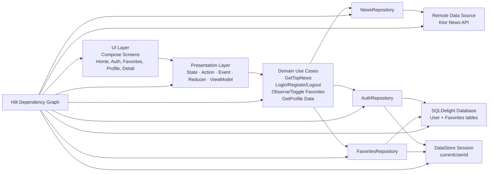
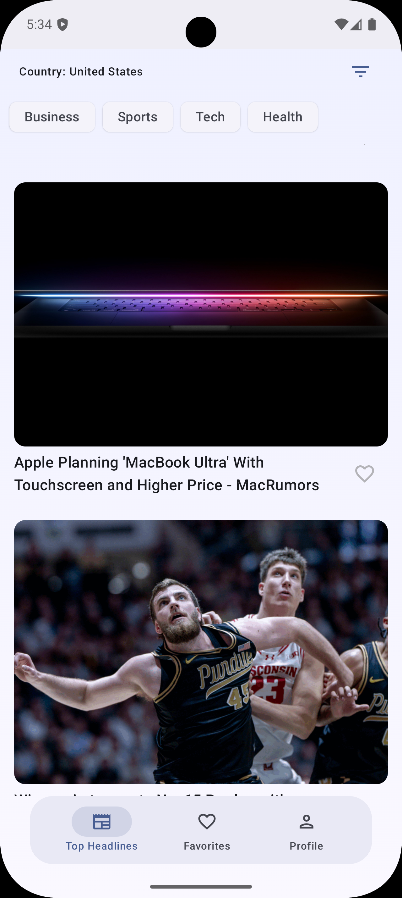
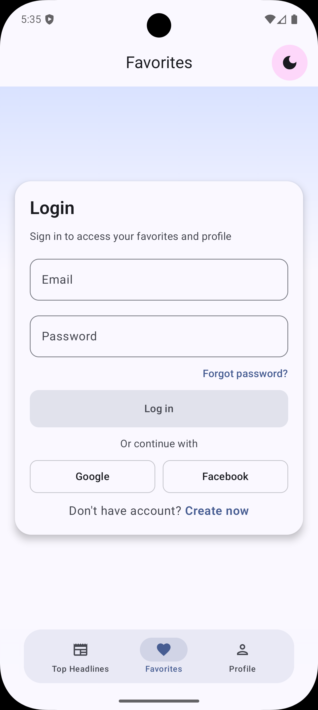
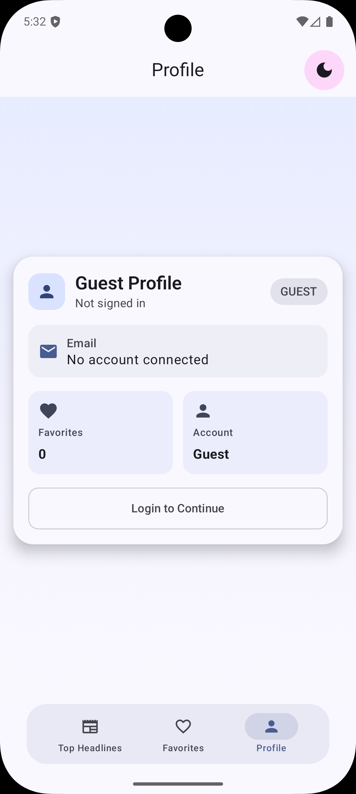
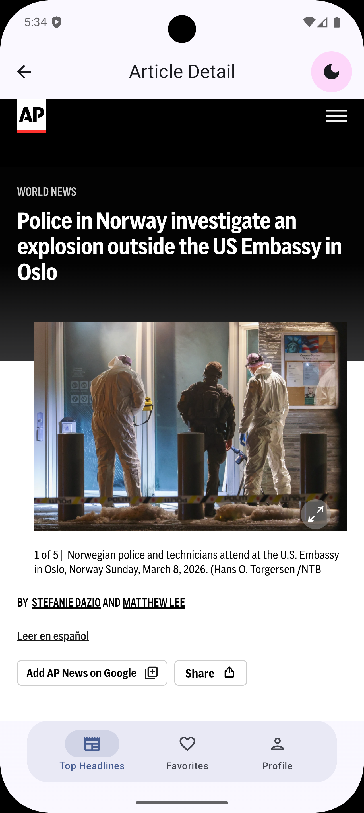

<div align="center">

# 🗞️ JetPack News App

### Production-Ready Android News App


A modern news app with public headlines, local auth, per-user favorites, profile management, and feature-first Clean Architecture.

</div>

---

## ✨ Highlights

- Public **Home** feed (works without login)
- Local **Auth** with **Login + Register**
- **Favorites** protected by login and persisted per user
- **Favorites unauthenticated state** shows inline login prompt
- **Profile** with modern elevated UI and account metrics
- **Article Detail** in-app reader with top-bar back navigation
- Material3 Compose UI with loading/error/empty/skeleton states
- Global gradient background effect across screens

## 🧱 Tech Stack

- Kotlin + Coroutines + Flow/StateFlow
- Jetpack Compose + Material3
- Navigation 3
- Hilt
- SQLDelight
- DataStore
- Ktor
- Coil

## 🏛 Full Architecture Diagram



## 🗂 Complete Code Structure

```text
app/newsapp/src/main/java/be/business/newsapp/
├── MainActivity.kt
├── MainContract.kt
├── MainViewModel.kt
├── NewsApp.kt
├── core/
│   ├── common/
│   │   └── UiState.kt
│   ├── data/
│   │   ├── local/
│   │   │   ├── datastore/
│   │   │   │   ├── DataManager.kt
│   │   │   │   └── PreferenceRepositoryImpl.kt
│   │   │   ├── session/
│   │   │   │   └── UserSessionStore.kt
│   │   │   └── sqldelight/
│   │   │       └── SqlDelightModule.kt
│   │   ├── remote/
│   │   │   ├── apiimpl/
│   │   │   ├── apis/
│   │   │   └── network/
│   │   └── repository/
│   │       ├── NewsRepositoryImpl.kt
│   │       └── PreferencesRepository.kt
│   ├── di/
│   │   ├── CoilModule.kt
│   │   ├── DataStoreModule.kt
│   │   ├── DatabaseModule.kt
│   │   ├── NetworkModule.kt
│   │   ├── RepositoryModule.kt
│   │   └── UseCaseModule.kt
│   ├── domain/
│   │   └── model/
│   │       └── Article.kt
│   └── presentation/
│       ├── AppState.kt
│       ├── BaseStateViewModel.kt
│       ├── BaseViewModel.kt
│       ├── ComposeMVIExtensions.kt
│       └── MviContract.kt
├── domain/
│   ├── model/
│   │   ├── genericresponse/
│   │   ├── newsresponse/
│   │   └── NewsResponse.kt
│   ├── repository/
│   │   └── NewsRepository.kt
│   └── usecase/
│       └── news/
├── feature/
│   ├── articledetail/
│   │   └── ArticleDetailScreen.kt
│   ├── auth/
│   │   ├── data/
│   │   ├── domain/
│   │   ├── navigation/
│   │   ├── presentation/
│   │   └── ui/
│   ├── favorites/
│   │   ├── data/
│   │   ├── domain/
│   │   ├── navigation/
│   │   ├── presentation/
│   │   └── ui/
│   ├── home/
│   │   ├── components/
│   │   ├── domain/
│   │   ├── navigation/
│   │   └── presentation/
│   ├── profile/
│   │   ├── navigation/
│   │   └── presentation/
│   └── search/
│       ├── SearchScreen.kt
│       └── navigation/
├── navigation/
│   ├── Entries.kt
│   ├── Navigator.kt
│   ├── NavRoutes.kt
│   └── NewsAppNavDisplay.kt
├── ui/
│   ├── components/
│   ├── shared/
│   └── theme/
└── utils/
```

SQL schema:

- `app/newsapp/src/main/sqldelight/be/business/newsapp/core/data/local/sqldelight/NewsSqlDatabase.sq`

## 📸 Screenshots

> Add images to `docs/screenshots/` with these names: `home.png`, `login.png`, `favorites.png`, `profile.png`, `detail.png`

| Home | Login |
|------|-------|
|  |  |

| Favorites | Profile |
|-----------|---------|
|  |  |

| Detail                                         |
|------------------------------------------------|
|  |

## 🚀 Build

```bash
./gradlew :app:assembleDevDebug
```

## ✅ Tests

```bash
./gradlew :app:testDevDebugUnitTest
```

Included tests:

- Auth reducer tests
- Home reducer tests
- Favorites use-case tests
